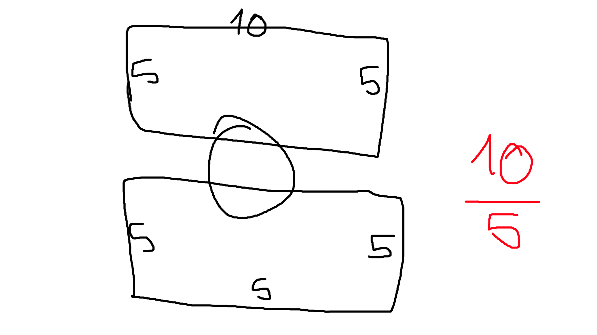

## Hivatkozások
1. Inline CSS
	- `
Lorem Ipsum
`
	- Nem nagyon használjuk mert átláthatatlan lesz a kód
	- Ha dinamikus formázás kerül az elemekre (JS DOM) 
2. Beágyazott
	- A `<head>`-be kell írni őket
	- A `<style>` páros tag-ek közé kell írni
	- Nem nagyon használjuk mert átláthatatlan lesz a kód
3. Külső állomány
	- `<link>` taggel lehet importálni
	- `<link rel="stylesheet" type="text/css" href="css útvonala">`
## Blokk színtű elmek és inline elemek
1. Blokkszíntű elemek
	- A böngéysző előtte és utána térközt helyez el. (margó)
2. Inline elemek
	 - A böngésző nem töri meg a sort, hanem abban jeleníti meg 
## Speciális blokkszíntű elemek
1. `
`: nincs jelentése, az elemek csoportosítására szolgál (blokkszíntű elemek csoportosítására)
2. ``: inline elemek csoportosítására, szolgáló HTML tag. Ha au oldal nyelvétől eltérő szöveget használunk akkor abban a tag-ben
## A dobozokról
A böngészőkben megjelenő elemek ugynevezett dobozokban helyezkednek le.
A legbelső doboz maga a **tartalom**, ennek a szélességét a width, a magasságát a height tulajdonsággal adhatjuk meg.
A **padding** (kitöltési, belső margó) , a tartalom és a **szegély** (**border**) között helyezkedik el. Végul s szegély és a többi elem közötti térköz nevezeik **margin**-nak. (margó)
## Border beállítása
1.  Az elemeket különböző méretű ls  stílusú szegélyekkel láthatod el.
2. A **border sorthand** CSS property segítségével állítható be. Mind a négy oldalra ugyanolyan szegélyt fog beállítani. Ennek értékeként a szegély vastagságát, stílusát és színét szükséges megadni
3. Szegély vastagság
	- angol kulcsszavakkal: thin (vékony), medium (közepes), thick (vastag)
	- abszolút mértékegységek hanszálatával pl.: px
4. Szegély stílusok
	- **solid** - folyamatos szegély
	- **dotted** - pontozott szegély
	- **dashed** - szagatott szegély
	- **double** - dupla szegély
	- **groove** - 3D-s vonal
	- **ridge** - 3D-s vonal
	- **inset** - 3D-s vonal
	- **outset** - 3D-s vonal
5. Szegélyek színe
	- Az angol nevekkel
	- színkoordináta rendszerekkel
6. Egyedi szegélyek
	- top - felső
	- right - jobb
	- bottom - alsó
	- left - bal
	- Property kinézet: pl.: border-left
7. Szegélyek lekerekítése
	- A **border-radius** tulajdonsággal le is kerekíthető a szegélyek sarkát. A tulajdonság értékét megadhatod abszolút és relatív mértékegységekkel is. 
	- Egyedi lekerkeítést lehetséges az összes sarokra egyesével:
		- **border-top-left-radius**: bal felső sarok
		- **border-top-right-radius**: jobb felső sarok
		- **border-bottom-left-radius**: bal alsó sarok
		- **border-bottom-right-radius**: jobb alsó sarok

## Szélesség és a magasság beállítása
Egy elem szélességét a **width**, míg magasságát a **height** **property**-vel  lehet állítani
Ezek az értékeit megadhatod mind, abszolút, mind relatív mértékegységgel. CSS-nyelven az is megadható, hogy mi legyen egy elem minimális illetve, maximális mérete. A szélességnél ezt a **min-width** és a **max-width**, míg a magasságával, a **min-height** és a **max-height** tulajdonsággal állítható be.
## A padding
A **padding tulajdonsággal** állíthatsz be **belső margót** vagy más néven **kitölteni**. Ez a gyakorlatban a szegélyek és a tartalom közötti távolságot jelenti. Ha a padding tulajdonság után egy értéket adsz meg a doboz mind a négy oldala ugyanazt az értéket veszi fel. 
Egyedi belső margók:
1. padding-top
2. padding-right
3. padding-bottom
4. padding-left
Vagy sorthand megoldás
 5. padding: top right bottom left
 6. padding top-bottom right-left, bottom left
## Margin
Egyes elemeknek mint például a bekezdéseknek alapértelmezett margójuk van. Ez akkor érvényesül nem állítasz be margóértéket nekik. Ennek értékét a stíluslapokon belül a **margin tulajdonsággal** lehet szabályozni

> Nem tudom mi ez, de Erik tanár úr ezt rajzolta fel

Középre úgy lehet igazítani, ha a **margó jobb és bal** értékét **auto**-ra állítjuk be.

## A dobozméret modósítása
A dobozmodell méretét lehet úgy is módosítani, hogy a szegélyével együtt vett szélesség és magasság értékét módosítjuk
## A szöveg formázása
## Szöveg igazitás
tulajdonsaggal állitbatjuk be.
Ertekelt
1. left - balra igazitás (A böngészőprogramokban az alapartelmezett)
2. center - középre igazitás
3. right - jobbra igazitás
4. justify - sorkizárás
## Szöveg dekoráció
1. Vonaltípusok
2. Vonalstílusok
	1.  solid - folytonos
	2. double - dupla
	3. dotted - pontos
3. Vonalszínek

## Szöveg transzoformációk
A **szöveg transzformációjának**, azaz a szöveg kis- és nagybetűje. illetve kezdőbetűje alakítását a deklarációs blokkban megadott **text-transforms** tulajdonsággal lehet beállítani
Értékei:
	1. uppercase - minden betű nagybetűvé alakul
	2. lowercase - minden betű kisbetűvé alakul
	3. capitalize - minden egyes szó első betűje nagybetűssé alakítja (Fontos: Ha tisztán nagybetűs a szöveg nem változtatja meg)
	4. none - a szöveg eredeto formája
## A szövegs sor behúzása
A bekezdések első sorának behúzása a **text-indent** tulajdonsággal lehetséges. Ennek az értéke relatív (%, om) vagy abszolut (mm, px) lehet.

## 

HTML & CSS matematika
## Előző: 
[[02.CSS alapok]]
## Következő:
[[04. Képek és illusztrációk]]
## Tagek:
#WebDevelopment #Programming #FrontendDevelopment #HTML #CSS #JavaScript #Bootstrap